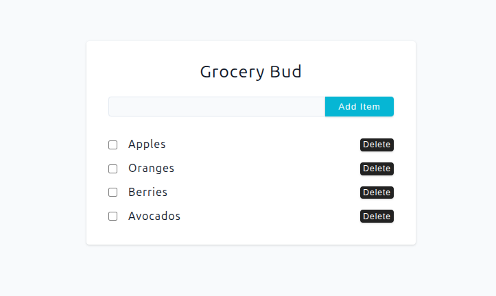
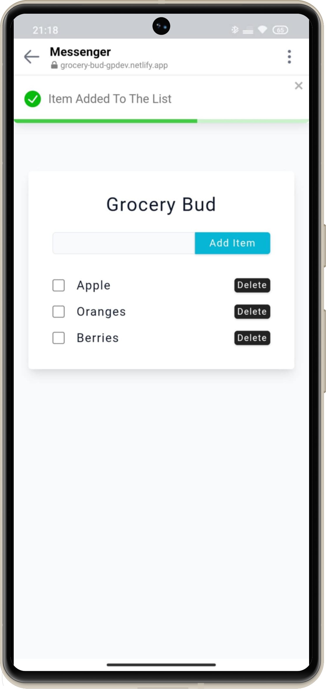

# Grocery Bud 🛒


A sleek and intuitive grocery list manager built with React. Perfect for keeping track of your shopping items with persistent storage and a clean, responsive interface. Built to practice React state management, component architecture, and modern CSS techniques.

## 🚀 Live Demo

**View Live on Netlify:**  
[Grocery Bud Demo ](https://grocery-bud-gpdev.netlify.app/)

## 🎯 Problem This App Solves:

- Provides a simple way to manage grocery shopping lists
- Eliminates the need for paper lists that can be lost or forgotten
- Offers item completion tracking to mark purchased items
- Includes persistent storage so your list survives browser refreshes
- Saves time and reduces shopping stress with organized item management

👥 Perfect For:

- 🛒 Everyday shoppers organizing their grocery trips
- 👨‍👩‍👧‍👦 Families coordinating shopping needs
- 📋 Meal planners tracking ingredients
- 📱 Anyone who wants a digital alternative to paper shopping lists

## 🎓 Key Learning Outcomes

- `State Management`: Mastered the useState hook to manage complex state (an array of objects) and implement CRUD (Create, Read, Update, Delete) operations in a React application.

- `Component Composition & Communication Through props`: Designed a clear component hierarchy (App -> Items -> SingleItem) and effectively passed state and functions down the component tree via props.

- `Lifting State Up`: Successfully refactored the application to move the - completed state from a local component state to the global App state, ensuring data consistency and persistence.

- `Controlled Inputs`: Implemented a fully controlled form input, handling user input via React state for a predictable and debug-friendly data flow.

- `Data Persistence`: Integrated the browser's Local Storage API to persist application state, creating a seamless user experience that survives page refreshes and browser sessions.

- `User Experience (UX) & Feedback`: Enhanced the UI/UX by integrating react-toastify to provide users with immediate and clear feedback for their actions (adding, editing, deleting items).

- `Project Tooling`: Gained experience with modern front-end build tools and libraries like Vite, Nanoid for ID generation, and CSS-in-JS techniques for dynamic styling.

## ✨ Features

- **Add Items** - Quickly add new grocery items to your list
- **Mark Complete** - Check off items as you shop with visual strikethrough
- **Remove Items** - Delete items you no longer need
- **Persistent Storage** - Your list saves automatically and persists between sessions
- **Responsive Design** - Works perfectly on desktop and mobile devices
- **Visual Feedback** - Toast notifications for actions and errors
- **Clean UI** - Modern, minimalist interface focused on usability

## 📸 Project Preview

<table>
  <tr>
    <td align="center"><strong>💻 Desktop View</strong></td>
  </tr>
  <tr>
    <td align="center"></td>
  </tr>
  
  <tr>
    <td align="center"><strong>📱 Mobile View</strong></td>
  </tr>
  <tr>
    <td align="center"></td>
  </tr>
  <tr>
    <td align="center"><em>Mobile responsive view </em></td>
  </tr>
</table>

## 🛠️ Built With

| Tool / Library         | Purpose                      |
| ---------------------- | ---------------------------- |
| ⚡ **Vite**            | Fast build tool & dev server |
| ⚛️ **React 19**        | Component-based UI           |
| 📋 **React-Toastify**  | Notification system          |
| 💾 Local Storage       | Persistent data storage      |
| 🔑 **Nanoid**          | Unique ID generation         |
| 🎨 **CSS3**            | Flexbox, Grid, animations    |
| 📜 **JavaScript ES6+** | Modern language features     |

## 💡 Implemented Concepts

### State Management

- **useState Hook** - Managing grocery items state
- **Component Communication** - Parent-child data flow through props
- **Lifting State Up** - Global state management for item completion

### Component Architecture

- **Modular Components** - Separated Form, Items, and SingleItem components
- **Reusable Components** - SingleItem component for consistent rendering
- **Conditional Rendering** - Dynamic styling based on completion status

### User Experience

- **Form Validation** - Prevents empty submissions with error feedback
- **Visual Feedback** - Toast notifications for user actions
- **Accessibility** - Semantic HTML and proper form labels
- **Persistence** - Local storage integration for data retention

## 🎨 Design

Figma design provided by the course instructor.
[View Figma Design](https://www.figma.com/file/8rXGl68NoEmAhHpcV7aB5o/Grocery-bud?node-id=0%3A1&t=IMjjwDExGWpXdpQL-1)

## 📦 Project Structure

```text
src/
├── components/
│   ├── Form.jsx
│   ├── Items.jsx
│   └── SingleItem.jsx
├── App.jsx
└── index.css
```

## 🚀 Getting Started

### Prerequisites

- **Node.js** ≥ 18.0.0
- **npm** or **yarn** package manager

### Installation

1. Clone the repository

```bash
git clone https://github.com/pro804/Grocery-Bud.git
```

2. Navigate to the project directory

```bash
cd Grocery-Bud
```

3. Install dependencies

```bash
npm install
```

4. Start the development server

```bash
npm run dev
```

5. Open http://localhost:5173 to view it in the browser.

## 🔧 Available Scripts

- `npm run dev` — Runs the development server (Vite)
- `npm run build` — Builds the app for production
- `npm run preview` — Previews the production build locally

## 📄 License

This project was created for educational purposes as part of a React learning journey.
This project is licensed under the MIT License.
See the [LICENSE](LICENSE) file for details.
